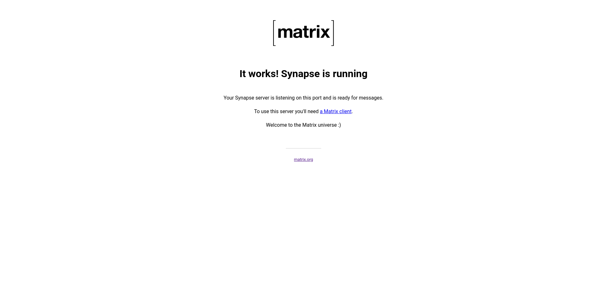

برای راه اندازی شبکه پیامرسان matrix.org که یه شبکه متن باز و امن و غیر متمرکز برای ارسال پیام است کافی است تا مراحل زیر را در این سرور داخل ایران طی کنید تا بتوانید یک پیامرسان شخصی داشته باشید.
در این آموزش از سرور synapse و کلاینت element استفاده شده که هر دو به صورت ازاد و متن باز و رایگان در اختیار همه قرار دارد.
برای راه اندازی سرور synapse مراحل زیر را دنبال کنید.

```Bash
mkdir synapse && cd synapse 
```
در پوشه ایجاد شده فایل زیر را ایجاد میکنیم.

*docker-compose.yml*
```Yaml
version: "3.3"
services:
  synapse:
    image: "matrixdotorg/synapse:latest"
    container_name: "synapse"
    volumes:
      - "./data:/data"
    environment:
      SYNAPSE_SERVER_NAME: "sub.domain.com"
      SYNAPSE_REPORT_STATS: "yes"
    ports:
      - "8008:8008"
```
در کنار این فایل پوشه ای برای داده های کانتینر خود ایجاد میکنیم.
```Bash
mkdir data
```
سپس دستور زیر را ران میکنیم تا فایل کانفیگ ساخته شود.
```Bash
docker-compose run --rm synapse generate
```
بعد از اجرای دستور بالا فایل کانفیگ به نام homeserver.yaml  در مسیر  ./data/homeserver.yaml ساخته میشود که برای کانفیگ کرد سرویس خود از این فایل استفاده میکنیم.

`نکته: نحوه ای که در این اموزش برای کانفیگ synapse گفته شده مدل اولیه این سرویس بوده و موارد از جمله تایید افراد برای ساخت اکانت در این اموزش پوشش داده نشده و توصیه میشود برای امنیت بیشتر در مقابل حملات ربات ها داکیومنت های اصلی خوانده شده و از یکی از روش های ذکر شده برای تایید افراد برای ساخت اکانت استفاده شود`

در فایل ایجاد شده خط های زیر را کپی کنید.

*./data/homeserver.yaml*
```Yaml
enable_registration: true
enable_registration_without_verification: true
```
بعد از انجام کارهای بالا اماده ران کردن سرور هستیم.
```Bash
docker-compose up -d
```
بعد از ران شدن اگر به صفحه ای که بر روی پورت ۸۰۰۸ اماده بالا بروید صفحه روبرو را میبینید.

بعد از این مرحله باید ساب دومین را برای استفاده راحتتر ست کنیم.
برای این کار کافیست که فایل کانفیگ زیر را در nginx ایجاد  کنیم سپس با کمک certbot هم ساب دومین خود را امن کنیم.
```Configuration
server {
    server_name sub.domain.com;
    location / {
        proxy_pass http://localhost:8008;
    }
}
```
مراحل اتصال به کمک کلاینت element:
بعد از نصب و طی مراحل بالا حالا به اتصال کلاینت به سرور میرسیم در این بخش کافیست تا اپلیکیشن element را از app store و یا باقی فروشگاه ها مانند f-droid دانلود کرده پس از طی مراحل اولیه به بخش اتصال به سرور میرسیم که در این بخش کافی است که ادرس سرور خود را به طور مثال https://sub.domain.com را وارد کرده و سپس مراحل ساخت اکانت را طی کنید.
حالا شما یک پیام رسان دارید :)

این اموزش در حال تکمیل است، از مشارکت های شما نیز استقبال میشود.